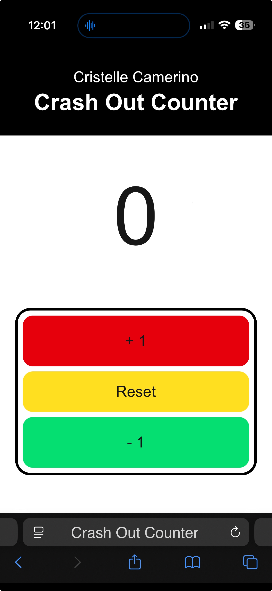

# Crash Out Counter

[](https://reactjs.org/)
[](https://nextjs.org/)
[](https://tailwindcss.com/)
[]()



> A playful counter app built to track how many times someone (like my little sister 😅) crashes out.

---

## ✨ Features

- 🔢 **Dynamic Counter** – Tap to increase or decrease the count.
- 💾 **Persistent State** – Count is saved with across reloads.
- 🔊 **Audio Alerts** – Alarm plays every 5 counts.
- 🚨 **Flashing Feedback** – Screen flashes on alarm trigger.
- ❗ **Reset Confirmation** – Avoids accidental resets.
- 📱 **Responsive** – Looks great on any screen size.

## 🛠️ Built With

```tsx
Next.js • React • Tailwind CSS • HTML5 Audio • LocalStorage API